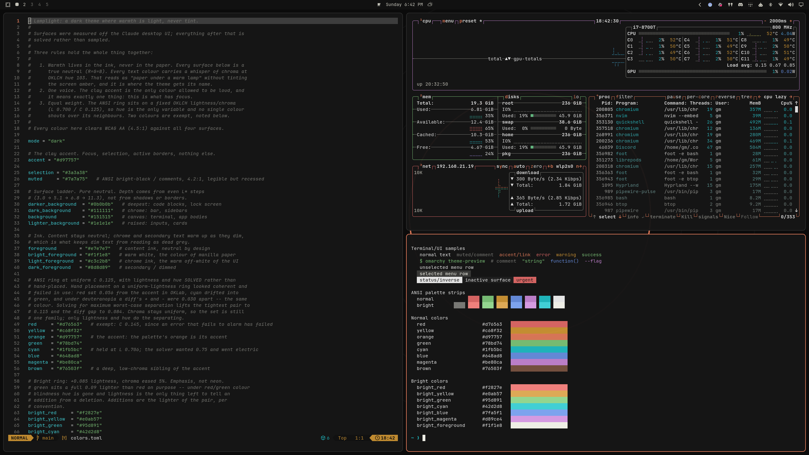
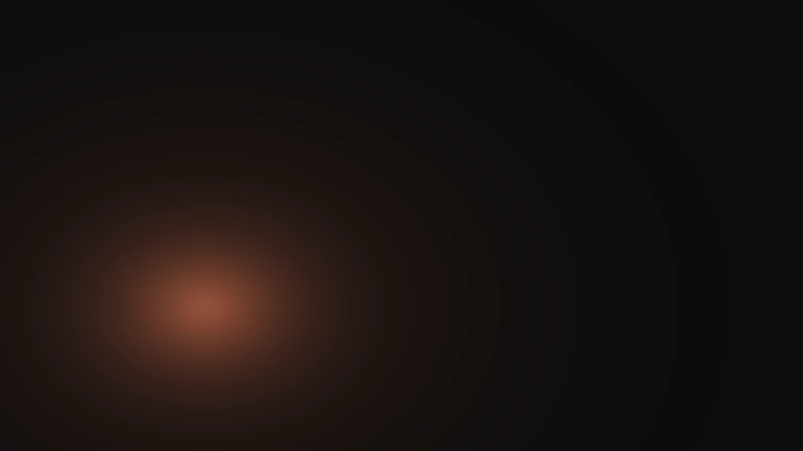
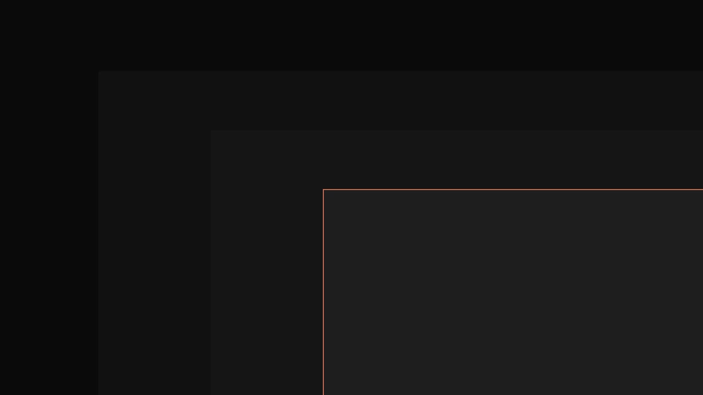
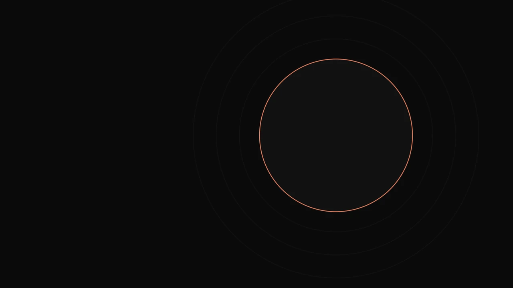
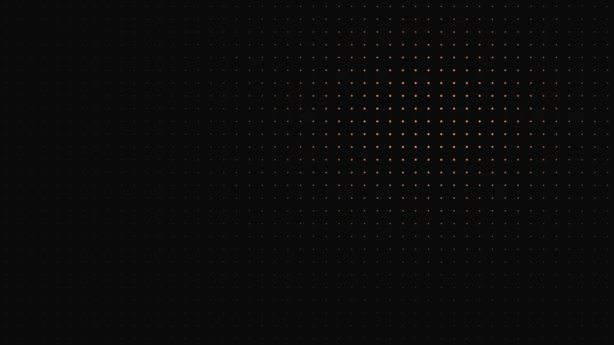
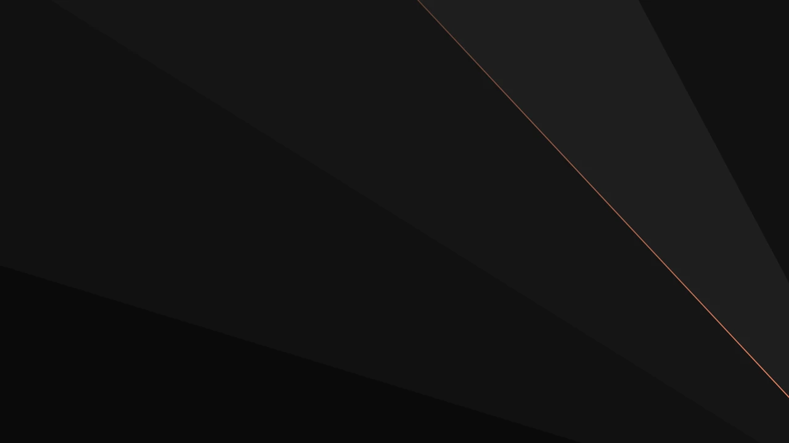

# Lamplight

A dark theme for [Omarchy](https://omarchy.org) where warmth is light, never tint.



## Install

```bash
omarchy theme install https://github.com/thisisgm/omarchy-lamplight-theme.git
```

## The three rules

1. **Warmth lives in the ink, never in the paper.** Every surface is a true
   neutral (R=G=B). Every text colour carries a whisper of chroma at OKLCH hue
   103. That reads as paper under a warm lamp without tinting the screen amber,
   and it is where the theme gets its name.
2. **One voice.** The clay accent `#d97757` is the only colour allowed to be
   loud, and it means exactly one thing: this is what has focus.
3. **Equal weight.** The ANSI ring sits on a fixed OKLCH lightness and chroma,
   so hue is the only variable and no single colour shouts over its neighbours.

Every colour clears WCAG AA (4.5:1) against all four surfaces. Foreground over
background measures 14.77:1.

## Why the ANSI ring is solved, not picked

Hand-placing the ANSI colours on a uniform-lightness ring looked coherent and
failed in use. Red sat 0.056 from the accent in OKLab, cyan drifted toward
green, and under deuteranopia a diff's `+` and `-` lines were 0.030 apart,
close enough to be the same colour.

Solving for maximum worst-case separation instead lifts the tightest pair to
0.115 and the diff gap to 0.084. Chroma stays uniform, so the set is still one
family; only lightness and hue do the separating. Two colours are exempt and
say so in `colors.toml`: red carries extra chroma, because an error that fails
to alarm has failed, and bright green sits a full 0.09 lighter than bright red
so that an addition still reads as the lighter of the pair when hue is gone.

## Backgrounds

Five wallpapers, each a different geometry, all rendered natively at
6016 × 3384 (16:9 6K).

They are dark by design. On a bright screen some read as almost black, which is
the point: mean luminance stays under 0.009 so the wallpaper is ground, never
figure.

### 1-terminator



Gradient. One light source, one falloff, nothing else. Mean luminance 0.0089.

### 2-ladder



Flat planes. The palette's own depth scale made literal, four panels stepping
down L\* 3.0, 5.1, 6.8, 11.3, with a single clay rule on the leading edge.
Mean luminance 0.0078.

### 3-aperture



Circle. One clay ring on near-empty ground with three neutral echoes far below
it in contrast. The quietest of the five. Mean luminance 0.0044.

### 4-lattice



Point grid. Dots grow and warm toward a light at the upper-right thirds point,
so the falloff reads as pattern rather than as haze. Mean luminance 0.0043.

### 5-fold



Facets. Angular planes fanning from a point past the lower-right corner, each
taking one rung of the surface ladder, one fold edge catching the accent.
Mean luminance 0.0072.

### How they are built

They are procedural rather than photographic, which is what lets them hold to
the palette exactly:

- **Composed in Oklab.** Blending in sRGB drags a midpoint toward grey, which
  is the muddy zone a warm-on-black gradient has to cross. Mixing in Oklab,
  the space the palette itself was solved in, keeps the accent's chroma all
  the way down to black.
- **Dithered at one LSB.** A near-black gradient across 6016 pixels has fewer
  distinct 8-bit values than it has room for, which is what produces visible
  rings. Interleaved gradient noise one output level wide, centred on zero,
  breaks the steps up. Because it is centred, a flat fill lands on an exact
  integer and stays perfectly flat.
- **Edged in pixel space.** Every hard edge is a signed distance in pixels
  resolved with a one-pixel box filter, not a smoothstep over normalised
  coordinates. An edge authored the second way scales its own softness up with
  the canvas, which at 6K means a visibly blurred line.
- **Marked in the exact accent.** Every accent mark is literally `#d97757`, the
  same value as `hyprland_active_border`, rather than a hand-picked
  approximation near it. `1-terminator` is the one exception and keeps only the
  accent's hue: it is a field rather than a mark, and the raw accent across a
  whole glow would drop content ink to 2.46:1.
- **Ceilinged for legibility.** `1-terminator` is capped so content ink still
  clears 4.5:1 over the brightest pixel in the frame.

Cycle them with `omarchy theme bg next`.

## Notes

Surfaces were measured off the Claude desktop UI; everything after that is
solved rather than sampled. This theme is not affiliated with or endorsed by
Anthropic.

Terminal colours render at Omarchy's stock window opacity (`0.985` focused,
`0.96` unfocused), so on-screen values sit slightly off the literal hex. That
is a compositor setting shared by every Omarchy theme, not a property of this
one. Set `opacity = "1.0 1.0"` in `~/.config/hypr/looknfeel.lua` for
pixel-exact colour.

## Support

If Lamplight earned a place on your desktop, you can
[buy me a coffee](https://buymeacoffee.com/thisisgm).

## License

MIT. See [LICENSE](LICENSE).
